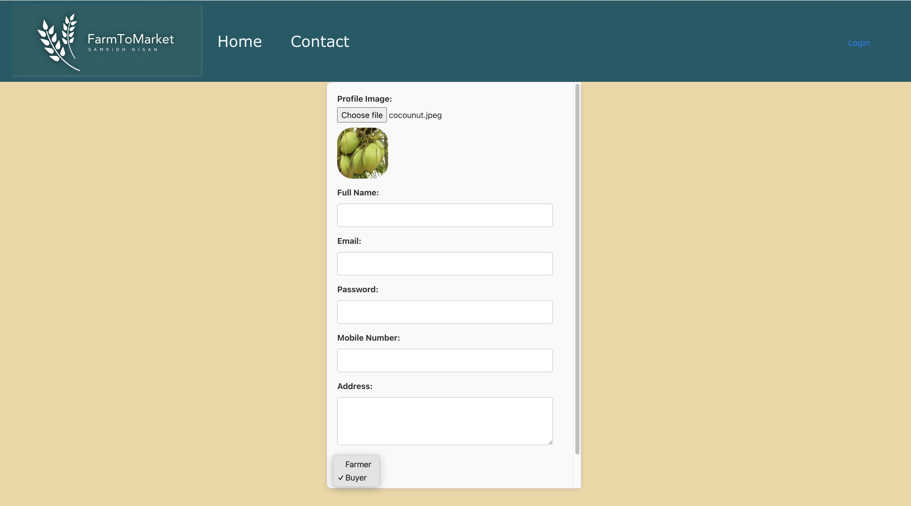
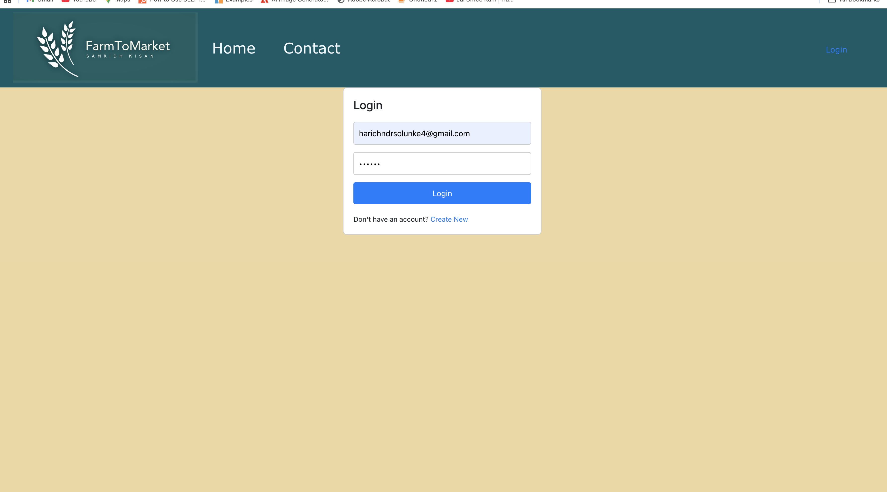
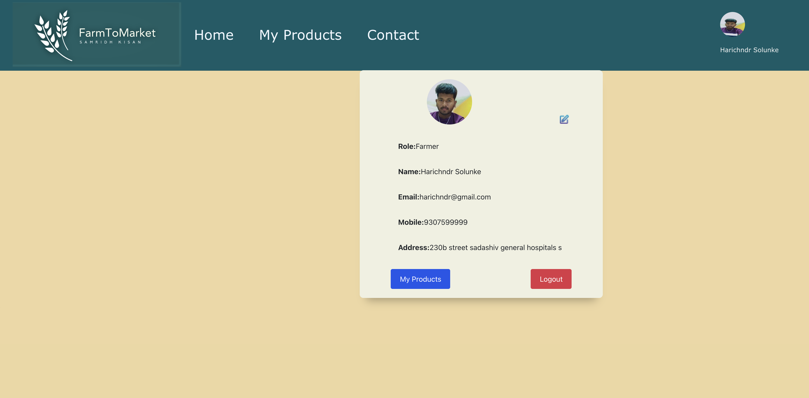
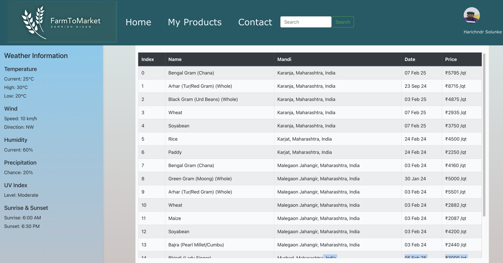
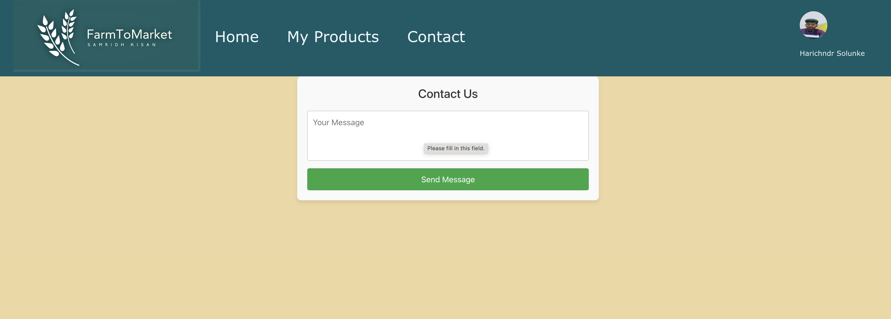
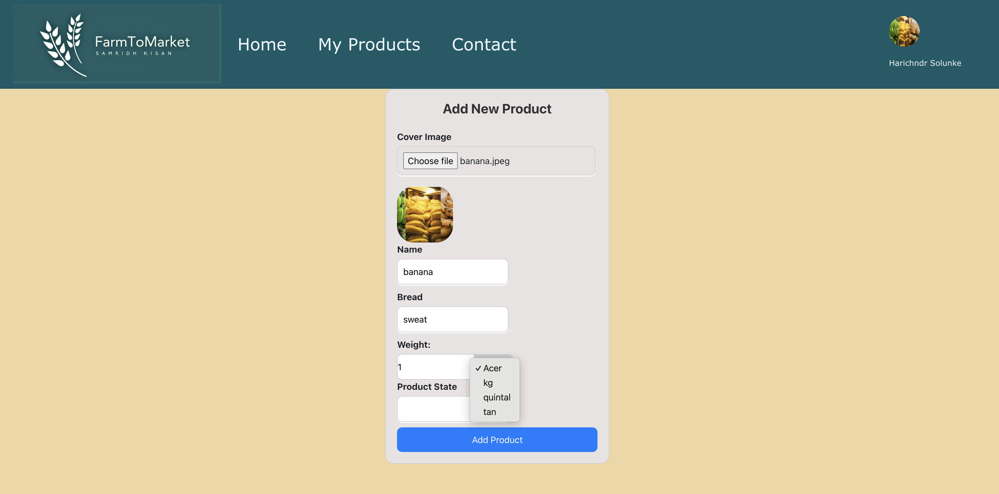
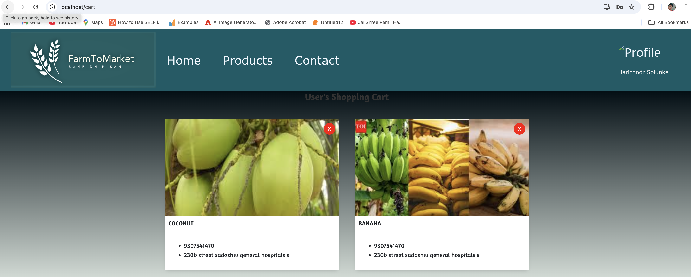

# 🌾 FarmsToMarket – MVP

**FarmsToMarket** is a role-based online marketplace for farmers to list their products online and for buyers to discover and contact farmers directly.  
The platform promotes transparency, direct communication, and a secure marketplace experience.

---

## 🚀 Project Overview

- Farmers can **add and manage products**
- Buyers can **browse products and add to cart**
- Admin can monitor feedback and platform usage
- **JWT-based authentication** and **RBAC** implemented
- Fully **Dockerized** for easy deployment

---

## 🧑‍🌾 User Roles

- **Farmer** – Add/manage products  
- **Buyer** – Browse products, add to cart, contact farmers  
- **Admin** – View feedback and monitor platform

---

## 🛠 Tech Stack

### Backend
- Node.js, Express.js
- MongoDB with Mongoose
- JWT authentication
- bcrypt for password hashing
- Multer for file uploads
- Cloudinary for optional image storage
- CORS support

### Frontend
- React, Redux
- Tailwind CSS

### DevOps
- Docker, Docker Compose

---

## 🔐 Authentication & Authorization

- JWT-based authentication for secure access
- Encrypted passwords using bcrypt
- Role-Based Access Control (RBAC)
- Protected routes for all roles

---

## ✨ Features

### 🔹 Common Features (All Users)

- **User Registration (Farmer / Buyer)**  
  

- **Login (Email & Password)**  
  

- **Profile Management**
  - View & update profile
  - Logout
  - Role-based action buttons  
  

- **Market Price Viewer**  
  

- **Search Market Prices**  
  

- **Contact Admin (Feedback Form)**  
  

---

### 🌱 Farmer Features

- **Add New Product**  
  

- **My Products Page**
- - **Delete Product (Confirmation Modal)**  
  - View all listed products
  - Search products  
  

- **Delete Product (Confirmation Modal)**  

---

### 🛒 Buyer Features

- **Products Page (View Farmers' Products)**
 - **Add to Cart**  
  


- **Cart Page**  
  

---

## env Var
```bash 
 MONGO_CONNECTION_STRING
PORT
CORS_ORIGIN
JWT_SECRET
CLOUD_NAME=
CLOUD_API_KEY
CLOUD_API_SECRET
STORAGE_URL

## 📦 Docker Setup

### 1️⃣ Clone Repository
```bash
git clone https://github.com/HarichndR/1-one farmstomarket
cd farmstomarket
docker-compose build
docker-compose up -d
